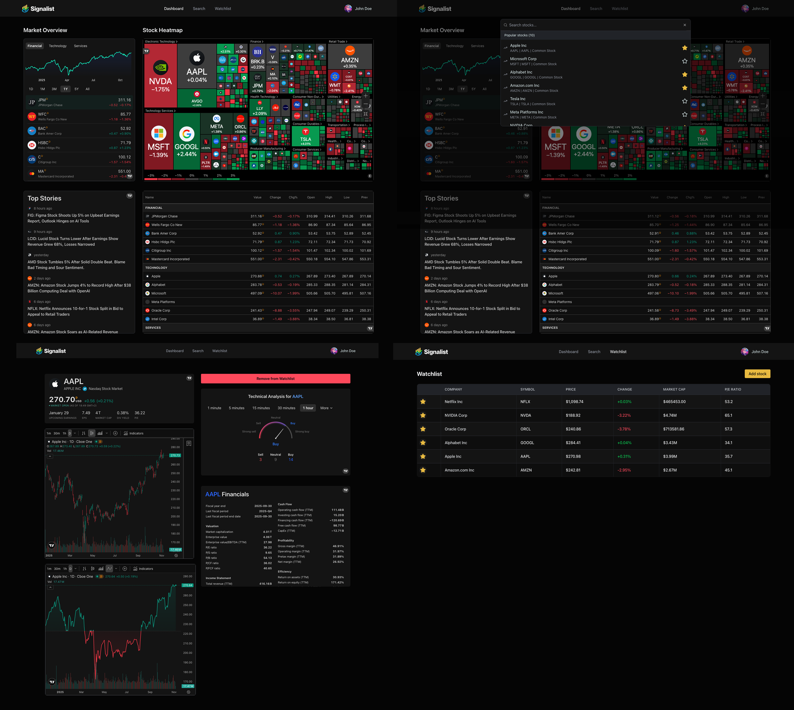

<div align="center">

# ⚡ Signalist — Real‑Time Stock Dashboard & AI‑Powered Insights

A full‑stack platform for tracking live stock data, managing personal watchlists, receiving AI‑generated news summaries, and exploring rich financial charts — secured with Better Auth and powered by Finnhub, TradingView, and Inngest.

</div>

---

<div align="center">

### 🛠 Built With

[](https://nextjs.org/)
[](https://www.typescriptlang.org/)
[](https://tailwindcss.com/)
[](https://ui.shadcn.com/)
[](https://mongodb.com/)
[](https://mongoosejs.com/)
[](https://www.better-auth.com/)
[](https://www.inngest.com/)
[](https://nodemailer.com/)
[](https://finnhub.io/)
[](https://tradingview.com/)
[](https://ai.google.dev/)

</div>

---

## 🧠 Overview

**Signalist** is a modern, full-stack stock market dashboard built with Next.js and TypeScript.  
It delivers real-time market insights, personalized watchlists, and AI-generated news summaries — all within a sleek, responsive interface.

Powered by **Finnhub**, **TradingView**, and **Google Gemini**, the platform combines live financial data with intelligent automation via **Inngest**.  
Secure authentication is handled through **Better Auth**, and all user data is stored in **MongoDB** for reliable persistence.

Designed for developers, traders, and analysts who want to explore scalable event-driven architecture, seamless AI integration, and production-grade UI patterns in a financial analytics environment.

---

## 📸 Demo



---

## 🌐 Live Demo

[](https://stock-tracker-app-psi-eight.vercel.app/sign-up)

---

### 🔍 Highlights

- ✅ Real‑time TradingView charts, heatmaps, and market data
- ✅ AI‑generated summaries (Gemini 2.5 Flash Lite)
- ✅ Personalized watchlists with optimistic UI updates
- ✅ Server Actions + Inngest background jobs (welcome email, daily news)
- ✅ Secure authentication with Better Auth + middleware guard
- ✅ Strong TypeScript typing + full TSDoc documentation
- ✅ Modular, scalable folder structure for production teams

---

## ✨ Features

- 📈 **Market Overview**: heatmap, movers, and quotes
- 🔎 **Search & Discover**: quick command palette with debounce
- ⭐ **Watchlist**: add/remove with optimistic UI & toast feedback
- 🧠 **AI Emails**: daily news summaries per user via Inngest + Gemini
- 🔐 **Auth**: Better Auth + cookie‑based edge middleware
- 📊 **Stock Detail**: candlestick, baseline, technicals, profile, financials

---

## 🗂 Project Structure

```bash
📁 project-root/
├── app/                      # Next.js App Router (routes, layouts, pages)
│   ├── (auth)/               # Auth pages (sign-in, sign-up)
│   ├── (root)/               # Main application pages (dashboard, watchlist)
│   └── api/ingest/           # Inngest route handler
├── components/               # Reusable UI + feature components
│   ├── forms/                # InputField, SelectField, CountrySelect…
│   ├── ui/                   # shadcn components
│   └── shared/               # Header, NavItems, SearchCommand…
├── database/                 # MongoDB & Mongoose models
│   ├── models/               # watchlist.model.ts etc.
│   └── mongoose.ts           # Database connector + cached instance
├── hooks/                    # Client-side React hooks
├── lib/                      # Core logic (auth, actions, inngest, nodemailer)
│   ├── actions/              # Server actions separated by domain
│   ├── better-auth/          # Auth instance + session handling
│   ├── inngest/              # Client, functions, prompts
│   ├── nodemailer/           # Templates + transporter
│   └── middleware/           # Helpers for request handling
├── public/                   # Static images, icons, TradingView assets
├── scripts/                  # DB test scripts
├── types/                    # Global TypeScript declarations
└── README.md
```

---

## ⚙️ Tech Stack

- **Frontend**: Next.js (App Router), TypeScript, shadcn/ui, Tailwind
- **Auth**: Better Auth + Next middleware (cookie presence check)
- **Data**: MongoDB + Mongoose
- **APIs**: Finnhub (quotes, profiles, news), TradingView widgets
- **Email**: Nodemailer (welcome + daily news)
- **Jobs**: Inngest (event + CRON “daily news summary”)
- **AI**: Gemini 2.5 Flash Lite (welcome intro & news summarization)

---

## 🚀 Getting Started

### 1) Clone & Install

```bash
git clone https://github.com/Oran01/stock-tracker-app.git
cd stock-tracker-app
npm install
```

### 2) Environment

Create `.env` from `.env.example` and fill values:

```dotenv
NODE_ENV=development
NEXT_PUBLIC_BASE_URL=http://localhost:3000

MONGODB_URI=your_mongodb_uri

BETTER_AUTH_SECRET=your_long_random_secret
BETTER_AUTH_URL=http://localhost:3000

GEMINI_API_KEY=your_gemini_api_key

# Nodemailer
NODEMAILER_EMAIL=your_email@gmail.com
NODEMAILER_PASSWORD=your_app_password

# Finnhub
FINNHUB_API_KEY=server_side_key
NEXT_PUBLIC_FINNHUB_API_KEY=public_key_for_widgets_if_needed
```

> **Security note:** prefer `FINNHUB_API_KEY` on the server and use `NEXT_PUBLIC_FINNHUB_API_KEY` only when intentional.

### 3) Database Check (optional)

```bash
# ESM quick check
node scripts/test-db.mjs

# TypeScript check (ts-node or tsx)
npx tsx scripts/test-db.ts
```

### 4) Dev Server

```bash
npm run dev
# open http://localhost:3000
```

---

## 🧩 Key Endpoints & Jobs

- **Inngest Serve (route handler)**: `app/api/ingest/route.ts`

  - Registers:
    - `sendSignUpEmail` — triggers on `app/user.created`
    - `sendDailyNewsSummary` — manual event `app/send.daily.news` or CRON `0 12 * * *`

- **Auth Guard**: `middleware.ts`  
  Lightweight cookie‑presence check; redirects unauthenticated users to `/sign-in`.

---

## 🛡 Security

- Do not commit real API keys or passwords.
- Use an app‑specific password for Gmail (Nodemailer).
- Keep Better Auth `secret` private and rotate as needed.

---

## 🧪 Scripts

```bash
npm run dev          # start Next.js locally
npm run build        # production build
npm run start        # run production

# DB diagnostics:
node scripts/test-db.mjs
npx tsx scripts/test-db.ts
```

---

## ▶️ Tutorial Followed

This project was originally inspired by and built following a YouTube tutorial by [JavaScript Mastery](https://www.youtube.com/@javascriptmastery):

- 📺 [Build and Deploy a Real-Time Stock Market App with Alerts, Charts & AI Insights | Next.js, Inngest](https://www.youtube.com/watch?v=gu4pafNCXng&list=WL&index=7)

---

## 🤝 Contributing

Feel free to fork this repository and submit pull requests to improve the project!

⭐ If you enjoyed this project, please consider giving it a star!
